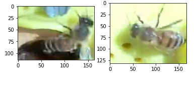
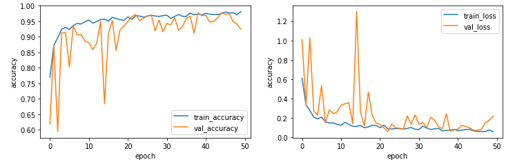
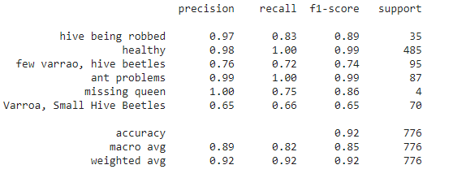
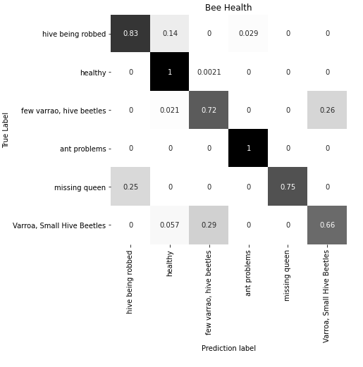
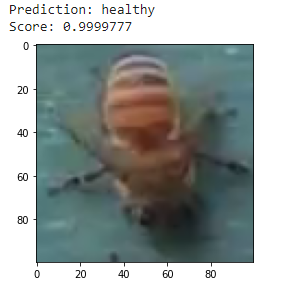
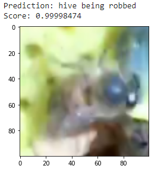

# Deep Learning Project

Honey Bee health classification using CNN.
 
 

Repository Content

•	Shubham_Final_Submission.ipynb  
•	Images Folder - Images from results obtained.
 
## Abstract

Every third bite of food relies on pollination by bees. 
 Pollinators transfer pollen and seeds from one flower to another, 
 fertilizing the plant to it can grow and produce food.
Cross-pollination helps at least 30 percent of the world’s crops and 90 percent of our wild plants to thrive. Without bees to spread seeds, many plants—including food crops—would die off.
 The main aim of this project is to track the health of Bees using the images of Bees in "The BeeImage Dataset: Annotated Honey Bee Images" dataset using the 
 convolutionalneural netwok. I have used transfer learning approach with Vgg-19 pretrained model to classify 
 health of Bees.

------------------------------------------------------------------------------

## Introduction

### The BeeImage Dataset
This dataset contains 5,100+ Bee images annotated with location, date, time, subspecies, health condition, caste, and pollen.

I have taken only Bee health in consideration and there are 6 classes related to Bee health namely 'hive being robbed', 'healthy', 'few varrao, hive beetles','ant problems', 'missing queen', 'Varroa, Small Hive Beetles'. I have split the dataset into train and test of 85% and 15% respectievely. Below are some images from dataset. The dataset can be downloaded from this link https://www.kaggle.com/jenny18/honey-bee-annotated-images/. 

### Data preprocessing and Image augmentation

Since the dataset contains many fields irrelevent to health of Bees, therefore processed the data using Pandas Dataframe and created a  training labelled data of Bees Health. also all iamges are resized to fix size of 100 , For this I have taken the reference code from '' repository from Kaggle.
Image augmentation is done to avoid overfitting of the model, ImageDataGenerator class from Keras is useed to perform the augmentation. zoom,flip and shift techniques are used to perform augmenation.

### VGG-19

VGG-19 is a convolutional neural network that is 19 layers deep. I have used the V66-19 model by Keras pretrained on  millions of images of Imagenet dataset. As a result, the network has learned rich feature representations for a wide range of images. The network has an image input size of 224*224. VGG19 is a variant of VGG model which in short consists of 19 layers (16 convolution layers, 3 Fully connected layer, 5 MaxPool layers and 1 SoftMax layer). 

### Libraries used:
Numpy,
Pandas,
OpenCV,
Matplotlib,
Keras,
scikit-learn

### Training of Model:
I have used the Transfer learning==> Feature extraction approach to train the model. I have used the VGG-19 model in Keras pretrained with 'Imagenet weights'. Since I have used Feature extraction approach to train the model, I have made changes only in last classification layer of model. Since the dataset contains 6 Health classes. I have added the output layer(softmax) which will output this 6 classes. The hyperparameters used for training are given below. I have got training accuracy 98% and testing accuracy of 92.4%

Hyperparameter | Epoch | Learning rate | Activation | Optimizer | Batch Size | loss
--- | --- | --- | --- |--- |--- |---
Value | 50 | 0.0001 | ReLu | Adam | 256 | categorical cross entropy 

## Evaluation of Model:

I have evaluated the model using precision,recall and F1-score metrics. To implement this I have used the classification_report function from scikit-learn library.

Precision - TP/(TP+FP) , where TP is true positive , FP is false positive ,FN is false negative

Recall-  TP/(TP+FN)

F1-score - (2 * precision * recall) / (precision +recall)

I have also plot the confusion matrix to evaluate the model. To implement this I have used confusion_matrix function from scikit-learn library.

## Results :

Since I have trained the model on 85% of images and remaining mages are used for testing purpose, I have got the F1-score of 93%. Below are the some of the predictions of images from the testing data by the trained model.

## References

